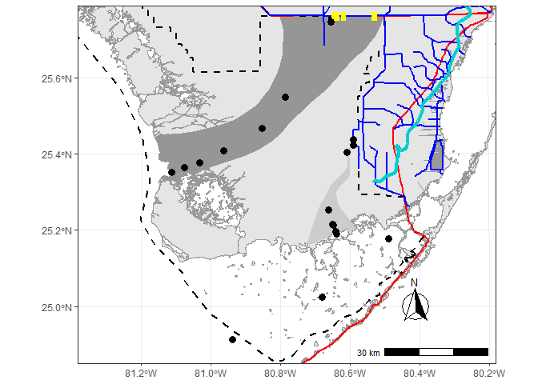

# EVERSpatDat

<!-- badges: start -->

[](https://lifecycle.r-lib.org/articles/stages.html#experimental)
<!-- badges: end -->

## Table of Contents

- [Introduction](#intro)
- [Citing package](#cite)
- [Installation](#install)
- [Example](#example)
- [List of Spatial Data](#datalist)

## Introduction

As more and more spatial data is becoming available this package was
intended to be a single source of general spatial data inspired by the
Florida Coastal Everglades Long Term Ecological Research Site ([FCE
LTER](https://github.com/FCE-LTER/maps_FCE_sites_grayscale_base)) study
area map repository.

## Citing package

``` r
citation('EVERSpatDat')
## 
## To cite package 'EVERSpatDat' in publications use:
## 
##   Paul Julian (2024). EVERSpatDat: Everglades Spatial Data. R package
##   version 0.1.0. https://github.com/SwampThingPaul/EVERSpatDat
## 
## A BibTeX entry for LaTeX users is
## 
##   @Manual{,
##     title = {EVERSpatDat: Everglades Spatial Data},
##     author = {Paul Julian},
##     year = {2024},
##     note = {R package version 0.1.0},
##     url = {https://github.com/SwampThingPaul/EVERSpatDat},
##   }
```

## Installation <a name="install"></a>

Development version can be installed from this repo using:

``` r
install.packages("devtools");# if you do not have it installed on your PC
devtools::install_github("SwampThingPaul/EVERSpatDat")
```

Currently there are no plans to send ths package to CRAN. However, in
the future that could change.

## List of Spatial Data

``` r
datalist<-data(package = "EVERSpatDat"); # see a list of the dataset
```

<table class=" lightable-classic" style="font-family: Cambria; margin-left: auto; margin-right: auto;">
<thead>
<tr>
<th style="text-align:left;">
Item
</th>
<th style="text-align:left;">
Title
</th>
</tr>
</thead>
<tbody>
<tr>
<td style="text-align:left;">
BBSEERBound
</td>
<td style="text-align:left;">
Biscayne Bay and Southeastern Everglades Ecosystem Restoration Project
Boundary
</td>
</tr>
<tr>
<td style="text-align:left;">
CEPP
</td>
<td style="text-align:left;">
Central Everglades Planning
</td>
</tr>
<tr>
<td style="text-align:left;">
CSSSSubpops
</td>
<td style="text-align:left;">
Cape Sable Seaside Sparrow Subpopulations
</td>
</tr>
<tr>
<td style="text-align:left;">
EvPA
</td>
<td style="text-align:left;">
Everglades Protection Area Boundary
</td>
</tr>
<tr>
<td style="text-align:left;">
FCELTER_sites
</td>
<td style="text-align:left;">
FCE LTER long-term monitoring sites
</td>
</tr>
<tr>
<td style="text-align:left;">
FWCShore_clip
</td>
<td style="text-align:left;">
Florida Shoreline 1:12000
</td>
</tr>
<tr>
<td style="text-align:left;">
LOK
</td>
<td style="text-align:left;">
Generalized Lake Okeechobee Boundary
</td>
</tr>
<tr>
<td style="text-align:left;">
LOSOM
</td>
<td style="text-align:left;">
Lake Okeechobee System Operating Manual
</td>
</tr>
<tr>
<td style="text-align:left;">
LOWRP
</td>
<td style="text-align:left;">
Lake Okeechobee Watershed Restoration Project
</td>
</tr>
<tr>
<td style="text-align:left;">
SFWMD_Projects
</td>
<td style="text-align:left;">
South Florida Water Management District Projects
</td>
</tr>
<tr>
<td style="text-align:left;">
SaltExtent
</td>
<td style="text-align:left;">
Inland Extent of Saltwater (2018)
</td>
</tr>
<tr>
<td style="text-align:left;">
TTBridge
</td>
<td style="text-align:left;">
Tamiami Trail Bridges
</td>
</tr>
<tr>
<td style="text-align:left;">
TribalAreas
</td>
<td style="text-align:left;">
Florida Tribal Areas
</td>
</tr>
<tr>
<td style="text-align:left;">
US41_US1
</td>
<td style="text-align:left;">
Major Roads for FCE LTER
</td>
</tr>
<tr>
<td style="text-align:left;">
WCAs
</td>
<td style="text-align:left;">
SFWMD Water Conservation Areas
</td>
</tr>
<tr>
<td style="text-align:left;">
WERPBound
</td>
<td style="text-align:left;">
Western Everglades Restoration Project Boundary
</td>
</tr>
<tr>
<td style="text-align:left;">
canals
</td>
<td style="text-align:left;">
South Florida Water Management District Canals
</td>
</tr>
<tr>
<td style="text-align:left;">
eaa
</td>
<td style="text-align:left;">
SFWMD Everglades Agricultural Area (EAA) Boundary
</td>
</tr>
<tr>
<td style="text-align:left;">
lakes
</td>
<td style="text-align:left;">
Lakes
</td>
</tr>
<tr>
<td style="text-align:left;">
nps_clipped
</td>
<td style="text-align:left;">
National Park Service areas in Everglades region
</td>
</tr>
<tr>
<td style="text-align:left;">
refuges_clipped
</td>
<td style="text-align:left;">
US Fish and Wildlife Service Refuges
</td>
</tr>
<tr>
<td style="text-align:left;">
sfwmd_bound
</td>
<td style="text-align:left;">
South Florida Water Management District Boundary
</td>
</tr>
<tr>
<td style="text-align:left;">
sloughs
</td>
<td style="text-align:left;">
General delineation of Shark River and Taylor Sloughs within Everglades
National Park
</td>
</tr>
</tbody>
</table>

## Example

``` r
library(sf)
library(tmap)
library(EVERSpatDat)

utm17<-st_crs("EPSG:26917");# CRS for NAD83 UTM17

tmap_mode("plot") 

# Load Package Data
data(list=datalist$results[,3]);# Loads all the data in the package

ENP <- subset(nps_clipped, UNIT_CODE=="EVER"); # Subsets for just ENP
```

### tmap

Using the [FCE
LTER](https://github.com/FCE-LTER/maps_FCE_sites_grayscale_base)
`/r_scripts/FCE_map_grayscale_base.R` as an example.

``` r

bbox.lims<-st_bbox(c(xmin=461316,xmax=582555,ymin=2748545,ymax=2852277),crs=utm17)

main.map <- tm_shape(FWCShore_clip,projection = 26917,ylim=bbox.lims[c(2,4)],xlim=bbox.lims[c(1,3)]) +
  tm_polygons(col="#f0f0f0",border.col="#525252") +
  tm_shape(sloughs[2,]) +
  tm_polygons(col = "#969696",border.col = "#969696") +
  tm_add_legend(type = "fill",col = "#969696",border.col = "#969696",
                labels = "Shark River Slough",z = 5 # position in the legend
                ) +
  tm_shape(sloughs[1,]) +
    tm_polygons(col = "#cccccc",border.col = "#cccccc") +
    tm_add_legend(type = "fill", col = "#cccccc",border.col = "#cccccc",
                  labels = "Taylor Slough",z = 4) +
  tm_shape(ENP) +
    tm_borders(col = "#525252",lwd = 1.5,lty = "dashed") +
    tm_add_legend(type = "line",lwd = 1.5,lty = "dashed",col = "#525252",
                  labels = "Everglades National Park",z = 6) +
  tm_shape(US41_US1) +
    tm_lines(col = "#cc0000",lwd = 1.5,lty = "solid") +
    tm_add_legend(type = "line", lwd = 1.5,col = "#cc0000", 
                  labels = "US Highways",z = 2) +
  tm_shape(TTBridge) +
    tm_lines(col = "#ffff00",lwd = 8,lty = "solid") +
    tm_add_legend(type = "line", lwd = 6, col = "#ffff00", 
                  labels = "Tamiami Trail bridges",z = 7) + 
  tm_shape(canals) +
    tm_lines(col = "#0000cc",lwd = 0.75,lty = "solid") +
    tm_add_legend(type = "line", lwd = 0.75, col = "#0000cc",
                  labels = "Canals",z = 1) +
  tm_shape(SaltExtent) +
    tm_lines(col = "#00cccc",lwd = 3,lty = "solid") +
    tm_add_legend(type = "line", lwd = 3, col = "#00cccc", 
                  labels = "Saltwater intrusion 2018",z = 9) +
  tm_shape(FCELTER_sites) +
    tm_symbols(size=.25,shape = 19,col = "#000000")

map.leg <- tm_graticules(lines = FALSE,labels.size = 0.8) +
  tm_add_legend(
    type = "symbol", 
    size=.25,
    shape = 19,
    col = "#000000", 
    labels = "FCE sites",
    z = 0
  ) +
  tm_compass(
    north = 0,
    text.size = 1.2,
    show.labels = 1,
    cardinal.directions = c("N", "E", "S", "W"),
    lwd = 1) +
  tm_scale_bar(
    width = 0.15,
    text.size = 0.8,
    color.dark = "black",
    color.light = "white",
    lwd = 1) +
  tm_layout(
    bg.color = "#ffffff",
    outer.margins = 0.001,
    legend.show = TRUE,
    legend.text.size = 0.9,
    legend.position = c("left","bottom")
  ) 

main.map+map.leg
```


<br>

### sf

Or if you prefer the `sf` flavor.

*NOTE:* The code below contains the native R pipe (`|>`, similar to the
tidyverse `%>%` but no extra packages needed). I don’t usually use pipes
to tie functions together but recently I’ve began to experiment to
consolidate code. In the code block below I proivde a pipe and non-pipe
example for those not comfortable or used to piping functions together
(its new for me too).

``` r
## Pipe version
states.shp=USAboundaries::us_states(resolution ="low")|>
  as("Spatial")|>
  st_as_sf()|>
  st_transform(utm17)|>
  subset(stusps%in%c("FL","GA","AL"))

## Non-pipe version
states.shp <- USAboundaries::us_states(resolution ="low")
states.shp <- as(states.shp,"Spatial")
states.shp <- st_as_sf(states.shp)
states.shp <- st_transform(states.shp,utm17)
states.shp <- subset(states.shp,stusps%in%c("FL","GA","AL"))
```

``` r
library(mapmisc)
library(USAboundaries)

states.shp <- USAboundaries::us_states(resolution ="low")|>
  as("Spatial")|>
  st_as_sf()|>
  st_transform(utm17)|>
  subset(stusps%in%c("FL","GA","AL"))

# bbox.lims=st_bbox(sloughs)
bbox.lims<-st_bbox(c(xmin=461316,xmax=582555,ymin=2748545,ymax=2852277),crs=utm17)

# Turn bounding bbox.lims into a polygon for plotting
AOI.poly <- raster::extent(bbox.lims)|>
  as("SpatialPolygons")|>
  st_as_sf()
st_crs(AOI.poly) = utm17

par(family="serif",mar=c(2,3,0.5,0.5),oma=c(1,1,0.1,0.1),plt=c(0.12,0.95,0.05,0.95));
layout(matrix(c(1:2),1,2),widths=c(1,0.5))

# Main plot
plot(st_geometry(FWCShore_clip),
     ylim=bbox.lims[c(2,4)],xlim=bbox.lims[c(1,3)],
     border="grey60",col = "grey90",
     graticule=st_crs("EPSG:4326"),
     lon=seq(-81.4,-80.2,0.3),lat=seq(24.8,25.8,0.3),
     axes=T,las=1,mgp=c(0,0.6,0))

plot(st_geometry(sloughs),add=T,col=c("grey80","grey59"),border=NA)
plot(st_geometry(ENP),add=T,lty=2,col=NA)
plot(st_geometry(US41_US1),add=T,col="red",lwd=1)
plot(st_geometry(canals),add=T,col="blue",lwd=0.75)
plot(st_geometry(TTBridge),add=T,col="yellow",lwd=4,lend=2)
plot(st_geometry(SaltExtent),add=T,col="darkturquoise",lwd=3)
plot(st_geometry(FCELTER_sites),add=T,pch=19,cex=1.25)
mapmisc::scaleBar(crs=FWCShore_clip,"bottomright",bty="n",cex=1,seg.len=4,outer=F)
box(lwd=1)

## Inset map
# idea from https://stackoverflow.com/a/21570835/5213091
opar <- par(plt=c(0.12,0.4,0.7,0.95),new=T)
bbox.lims<-st_bbox(subset(states.shp,stusps=="FL"))
plot.new()
plot(st_geometry(states.shp),col="grey60",lwd=0.5,
     ylim=bbox.lims[c(2,4)],xlim=bbox.lims[c(1,3)])
plot(st_geometry(AOI.poly),add=T,col=NA,border="red",lty=1,lwd=2)
box(lwd=1)

# if you wanted it on the side with the legend -- specify layout(matrix(c(1,1,2:3),2,2),widths=c(1,0.5))
# par(mar=c(0.5,0.5,0.5,0.5))
# plot(st_geometry(states.shp),col="grey60",lwd=0.5)
# plot(st_geometry(AOI.poly),add=T,col=NA,border="red",lty=2,lwd=2)
# box(lwd=1)

## Legend
par(mar=c(0.5,0.2,0.5,0.1))
plot(0:1,0:1,ann=F,axes=F,type="n")
legend("center",
       legend=c("FCE Sites",
                "Canals","US Highways",
                "Taylor Slough","Shark River Slough",
                "Everglades National Park",
                "Tamiami Trail Bridges",
                "Saltwater Intrusions (2018)"),
       pch=c(21,NA,NA,22,22,NA,NA,NA),
       pt.bg=c("black",NA,NA,"grey80","grey59",NA,NA,NA),
       lty=c(NA,1,1,NA,NA,2,1,1),lwd=c(NA,1.5,1,NA,NA,1,4,2),
       col=c("black","blue","red",NA,NA,"black","yellow","darkturquoise"),
       pt.cex=2,ncol=1,cex=0.8,bty="n",y.intersp=1.2,x.intersp=0.75,xpd=NA,xjust=0.5,yjust=0.5)
```


### ggplot2

For those that like ggplot style.

``` r
library(ggplot2)
library(ggspatial)

theme_set(theme_bw())

bbox.lims<-st_bbox(c(xmin=461316,xmax=582555,ymin=2748545,ymax=2852277),crs=utm17)
ggplot(data = FWCShore_clip,col = "grey90",border="grey60") +
  geom_sf() +
  layer_spatial(sloughs,aes(col=LTER_SLOUG),fill=c("grey80","grey59"),col=NA) + 
  layer_spatial(ENP,fill=NA,col="black",linetype=2,size=2) + 
  layer_spatial(US41_US1,fill=NA,col="red",linetype=1,size=2) + 
  layer_spatial(canals,fill=NA,col="blue",linetype=1,size=2) + 
  layer_spatial(TTBridge,fill=NA,col="yellow",linetype=1,size=4) + 
  layer_spatial(SaltExtent,fill=NA,col="darkturquoise",linetype=1,size=3) + 
  layer_spatial(FCELTER_sites,shape=19,size=3) + 
  annotation_scale(location = "br", width_hint = 0.25) +
  annotation_north_arrow(location = "br", which_north = "true", 
                         pad_x = unit(0.75, "in"), pad_y = unit(0.5, "in"),
                         style = north_arrow_fancy_orienteering) + 
  coord_sf(ylim=bbox.lims[c(2,4)],xlim=bbox.lims[c(1,3)], expand = FALSE,crs=st_crs(26917))
```



------------------------------------------------------------------------
